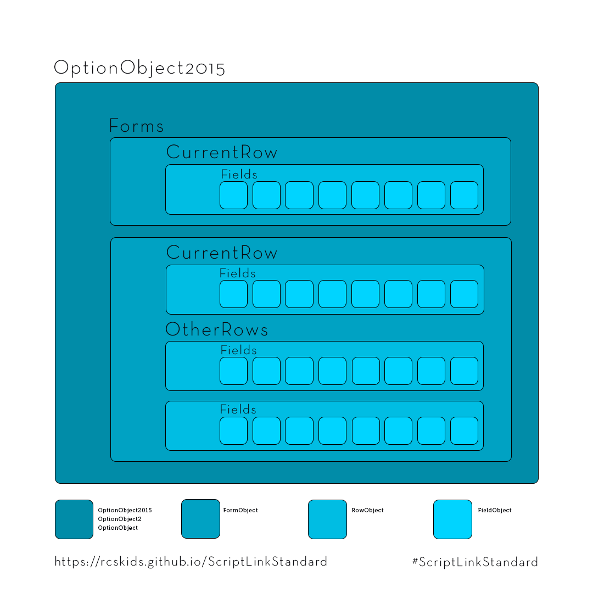

# ScriptLinkStandard.Objects

The ScriptLinkStandard.Objects namespace includes the classes that define the XML contract required for use with myAvatar ScriptLink.

It is recommended that you use the [OptionObject2015](optionobject2015.md) class. This is required if you use ScriptLink with Avatar Web Services and Cache 2016 or later.

## Structure

* OptionObject: [OptionObject2015](optionobject2015.md), [OptionObject2](optionobject2.md), or [OptionObject](optionobject.md)
  * Forms: List<[FormObject](formobject.md)>
    * CurrentRow: [RowObject](fowobject.md)
      * Fields: List<[FieldObject](fieldobject.md)>
    * OtherRows: List<[RowObject](rowobject.md)>
      * Fields: List<[FieldObject](fieldobject.md)>

[OptionObject2015](optionobject2015.md), [OptionObject2](optionobject2.md), and [OptionObject](optionobject.md) have a same fundamental structure though there are differences in root level properties.

## Helper Objects

The ScriptLinkStandard.Objects namespace also includes some static classes that help you write valid code.

* [ErrorCode](errorcode.md) provides valid ErrorCode options for use with return [OptionObjects](optionobject2015.md).
* [FieldAction](fieldaction.md) provides valid FieldAction options for manipulating [FieldObjects](fieldobject.md) with ScriptLinkHelpers.
* [RowAction](rowaction.md) provides valid RowAction options for use with [RowObjects](rowobject.md).
